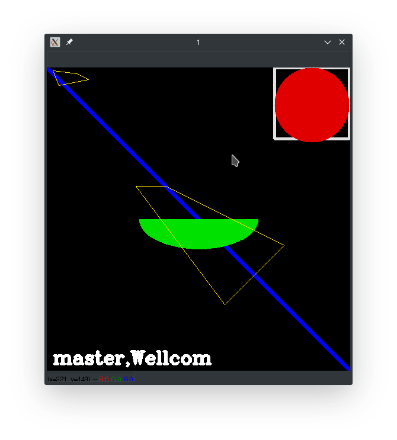

## OpenCV绘图功能

---

## 目标

- 学习使用OpenCV绘制不同的几何形状
- 您将学习以下函数：**cv2.line（）**，**cv2.circle（）**，**cv2.rectangle（）**，**cv2.ellipse（）**，**cv2.putText（）**等。

---

在上述所有函数中，您将看到如下所示的一些常见参数：

- mg：要绘制形状的图像

- 颜色：形状的颜色。对于BGR，将其作为元组传递，例如：`(255,0,0)`for blue。对于灰度，只需传递标量值。

- 厚度：线条或圆形等的厚度。对于圆形等闭合数字，如果为**-1**，则会填充形状。*默认厚度= 1*

- lineType：线的类型，是否为8连接，消除锯齿线等*。默认情况下，它是8连接的。*

  `cv2.LINE_AA`给出抗锯齿线，看起来很适合曲线。

---

#### 注意：OpenCV默认左上角为坐标原点（0,0）>~<


#### 绘图线--cv2.line()

---

要绘制线条，您需要传递线条的**起点**和**终点坐标**。

下面案例，我们将创建一个黑色图像，并在其上从左上角到右下角绘制一条蓝线。

```python
import numpy as np
import cv2

#绘制一张黑色背景，颜色模式为(0,0,0)
img = np.zeros((512,512,3) , np.uint8)
img = cv2.line(img , (0,0) , (511,511) , (255,0,0) ,5)
cv2.imshow('1' , img)
cv2.waitKey()
cv2.destroyAllWindows()

```

np.zeros(shape, dtype=float, order='C')

返回：返回来一个给定形状和类型的用0填充的数组

参数：

1. shape:形状

2. dtype:数据类型，可选参数，默认numpy.float64

       dtype类型：t ,位域,如t4代表4位
       
                 b,布尔值，true or false
       
                 i,整数,如i8(64位）
       
                 u,无符号整数，u8(64位）
       
                 f,浮点数，f8（64位）
       
                 c,浮点负数，
       
                 o,对象，
       
                 s,a，字符串，s24
       
                 u,unicode,u24


### 绘制矩形--cv2.rectangle()

----

要绘制矩形，您需要矩形的参数：**左上角**和**右下角**。

案例将在图像的右上角绘制一个绿色矩形

```python
img=cv2.rectangle(img , (384,0) , (510,120) , (225,225,225) , 3
```


### 绘制圆

---

要绘制圆，您需要其参数：**中心坐标**和**半径**

1. 绘图对象
2. 中心位置（x ， y）
3. 圆的半径
4. 线条颜色和格式

案例中我们将在上面绘制的矩形内绘制一个圆

```python
img = cv2.circle(img , (447,63) , 63 , (0,0,225) , -1)
```


### 绘制椭圆

---

绘制椭圆需要传递以下参数：

1. 绘图对象

2. 中心位置（x ， y）

3. 椭圆的轴长度，包括长轴长度，短轴长度

4. angle，椭圆在逆时针方向上的旋转角度

5. starAngle，表示从长轴开始顺时针方向测量椭圆弧的开始

   endAngle，表示从长轴开始顺时针方向测量椭圆弧的结束

   0到360为一个完整的椭圆

6. 线条的颜色

7. 线条的宽度，-1代表填充

```
img = cv2.ellipse(img , (256,256) , (100,50) , 0 , 0 , 180 , (0,225,0) , -1)
```


### 绘制多边形

---

画多边形需要指定一系列多边形的顶点坐标，相当于从第一个点到第二个点画直线，再从第二个点到第三个点画直线....

绘制多边形应具有以下参数：

1. 绘图对象

2. 多边形的顶点坐标，需要为int32位数据，可以是矩阵

   OpenCV中需要先将多边形的顶点坐标需要变成`顶点数×1×2`维的矩阵，再来绘制

3. 参数3如果是False的话，多边形就不闭合，True表示闭合

   样例：

   ```python
   #设置顶点数组
   pts = np.array([[10 , 5] , [20 , 30] , [70 , 20] , [50 , 10]] , np.int32)
   #数组转置
   pts2 = pts.reshape((-1,1,2))#第一个参数-1代表设置，第二个参数代表1行，第三个参数代表每个元素的数据数量
   #绘制图像
   img = cv2.polylines(img , [pts2] ,True, (0,225 , 255) , 1)
   ```

   **注意**：上面绘制出是一个封闭图像

   但是img = cv2.polylines(img , pts2 ,True, (0,225 , 255) , 1)绘制出是四个顶点，没有连线

   原因在于[pts2]是一个4列1行2元素的矩阵，pts2只是四个1行2列矩阵，也就是说，可以尝试在一个函数中绘制多个图像。

   尝试：

   ```
   pts = np.array([[10 , 5] , [20 , 30] , [70 , 20] , [50 , 10]] , np.int32)
   pts2 = pts.reshape((-1,1,2))
   
   pts3 = np.array([[150 , 200] , [300 , 400] , [400 , 300] , [200 , 200]] , np.int32)
   
   mg = cv2.polylines(img , [pts2 , pts3],True, (0,225 , 255) , 1)
   ```

   成功输出两个图像，猜测cv2.polylines()函数，会从第一点连接到第二点，从第二个点连到第三个点....直到连完四个点之后，第一个图像绘制结束。


#### numpy.reshape

`numpy.reshape`**（**a*，*newshape*，*order ='C'**）**

作用是在不改变矩阵的数值的前提下修改矩阵的形状

参数：

1. a  需要整形的数组

2. **newshape** ： int或int of int

   新形状应与原始形状兼容。如果是整数，则结果将是该长度的1-D数组。一个形状尺寸可以是-1。在这种情况下，该值是从数组长度和剩余维度推断出来的

   **缺省值-1代表我不知道要给行（或者列）设置为几，reshape函数会根据原矩阵的形状自动调整**

3. order ： {'C'，'F'，'A'}，可选

   使用此索引顺序读取a的元素，*并*使用此索引顺序将元素放入重新整形的数组中。

   **C**表示使用类似C的索引顺序读取/写入元素，最后一个轴索引变化最快，返回到第一个轴索引变化最慢

   **F**表示使用类似Fortran的索引顺序读/写元素，第一个索引变化最快，最后一个索引变化最慢。请注意

   **C**和**F**选项不考虑底层数组的内存布局，只涉及索引的顺序。

   **A**表示以类似Fortran的索引顺序读取/写入元素，如果*a*在内存中是Fortran *连续*的，否则是C-like顺序。


### 向图像添加文字：

---

要将文本放入图像中，您需要指定以下参数：

- 修改的图像对象
- 要写入的文本数据
- 您想要放置它的位置坐标（即数据开始的左下角）。
- 字体类型（检查支持字体的**cv2.putText（）**文档）
- 字体缩放（指定字体大小）
- 字体效果，如颜色，厚度，线型等。为了更好的外观，建议。`lineType = cv2.LINE_AA`

```
字体类型
FONT_HERSHEY_SIMPLEX
Python: cv.FONT_HERSHEY_SIMPLEX
正常大小的无衬线字体

FONT_HERSHEY_PLAIN
Python: cv.FONT_HERSHEY_PLAIN
小型无衬线字体

FONT_HERSHEY_DUPLEX
Python: cv.FONT_HERSHEY_DUPLEX
正常大小的sans-serif字体(比FONT_HERSHEY_SIMPLEX更复杂)

FONT_HERSHEY_COMPLEX
Python: cv.FONT_HERSHEY_COMPLEX
正常大小衬线字体

FONT_HERSHEY_TRIPLEX
Python: cv.FONT_HERSHEY_TRIPLEX
正常大小的衬线字体(比FONT_HERSHEY_COMPLEX更复杂)

FONT_HERSHEY_COMPLEX_SMALL
Python: cv.FONT_HERSHEY_COMPLEX_SMALL
FONT_HERSHEY_COMPLEX的较小版本

FONT_HERSHEY_SCRIPT_SIMPLEX
Python: cv.FONT_HERSHEY_SCRIPT_SIMPLEX
书写风格的字体

FONT_HERSHEY_SCRIPT_COMPLEX
Python: cv.FONT_HERSHEY_SCRIPT_COMPLEX
FONT_HERSHEY_SCRIPT_SIMPLEX的更复杂的变体

FONT_ITALIC
Python: cv.FONT_ITALIC
标志为斜体字体
```


样例：

```
cv2.putText(img , 'master,Wellcom' , (10, 500) , font , 1 ,(255 , 255 , 255) , cv2.LINE_4)
```


---

展示：

```python
import numpy as np
import cv2


img = np.zeros((512,512,3) , np.uint8)
img = cv2.line(img , (0,0) , (511,511) , (255,0,0) ,5)
img=cv2.rectangle(img , (384,0) , (510,120) , (225,225,225) , 3)
img = cv2.circle(img , (447,63) , 63 , (0,0,225) , -1)
img = cv2.ellipse(img , (256,256) , (100,50) , 0 , 0 , 180 , (0,225,0) , -1)

pts = np.array([[10 , 5] , [20 , 30] , [70 , 20] , [50 , 10]] , np.int32)
pts2 = pts.reshape((-1,1,2))
pts3 = np.array([[150 , 200] , [300 , 400] , [400 , 300] , [200 , 200]] , np.int32)
mg = cv2.polylines(img , [pts2 , pts3],True, (0,225 , 255) , 1)

font = cv2.FONT_HERSHEY_COMPLEX
cv2.putText(img , 'master,Wellcom' , (10, 500) , font , 1 ,(255 , 255 , 255) , cv2.LINE_4)

cv2.imshow('1' , img)
cv2.waitKey()
cv2.destroyAllWindows()

```

效果：


### 鼠标作为画笔

---

- 学习如何在OpenCV中处理鼠标事件

- 您将学习以下函数：**cv2.setMouseCallback（）**

接下来我们创建一个简单函数，无论我们在哪里双击都会在图像上绘制一个圆

> **第一步**

> 我们创建一个鼠标回调函数，该函数在鼠标事件发生时执行。该函数可以是与鼠标相关的任意鼠标事件(函数)，如左键点击，左键向上等。它将会为我们提供鼠标事件的坐标（x，y）。通过此活动和坐标，我们可以做任意操作。

> 运行代码：

```python
import cv2
events = [i  for i in dir(cv2) if 'EVENT' in i]
print(events)
# 输出所有的鼠标事件对应函数
```

> 输出如下：

```
['EVENT_FLAG_ALTKEY', 'EVENT_FLAG_CTRLKEY', 'EVENT_FLAG_LBUTTON', 'EVENT_FLAG_MBUTTON', 'EVENT_FLAG_RBUTTON', 'EVENT_FLAG_SHIFTKEY', 'EVENT_LBUTTONDBLCLK', 'EVENT_LBUTTONDOWN', 'EVENT_LBUTTONUP', 'EVENT_MBUTTONDBLCLK', 'EVENT_MBUTTONDOWN', 'EVENT_MBUTTONUP', 'EVENT_MOUSEHWHEEL', 'EVENT_MOUSEMOVE', 'EVENT_MOUSEWHEEL', 'EVENT_RBUTTONDBLCLK', 'EVENT_RBUTTONDOWN', 'EVENT_RBUTTONUP']
部分说明：
EVENT_MOUSEMOVE 滑动
EVENT_LBUTTONDOWN 左击
EVENT_RBUTTONDOWN 右击
EVENT_MBUTTONDOWN 中键点击
EVENT_LBUTTONUP 左键放开
EVENT_RBUTTONUP 右键放开
EVENT_MBUTTONUP 中键放开
EVENT_LBUTTONDBLCLK 左键双击
EVENT_RBUTTONDBLCLK 右键双击
EVENT_MBUTTONDBLCLK 中键双击
```

> **常见鼠标回调函数**

> 创建鼠标回调函数具有特定的格式，所有的鼠标函数创建回调函数时都是一样的格式。

> 我们使用鼠标回调函数绘制了一个双击的圆圈

```python
def  draw_circle(event , x , y , flags , param):
    if event == cv2.EVENT_LBUTTONDBLCLK:
        cv2.circle(img , (x , y) , 100 , (225,100 ,10) , -1)
```

> 使用cv2.setMouseCallback（）记录鼠标事件

```python
img = np.zeros((512,512,3) , np.uint8)
cv2.namedWindow('img')
cv2.setMouseCallback('img' , draw_circle)

while(1):
    cv2.imshow('img' , img)
    if cv2.waitKey(20) &0xFF == 27:
        break
cv2.destroyAllWindows()
```

接下来

我们通过拖动鼠标绘制矩形或圆形


### 轨迹栏作为调色板

---

- 学习将轨迹栏绑定到OpenCV窗口
- 将学习以下函数：**cv2.getTrackbarPos（）**，**cv2.createTrackbar（）**等。

**案例：**

将创建一个简单的应用程序，显示您指定的颜色。您有一个显示颜色的窗口和三个轨道栏，用于指定B，G，R颜色


**函数讲解：**

##### **cv2.getTrackbarPos（）**

```
参数：
1. 第一个参数是轨道栏名称
2. 第二个参数是它所附加的窗口名称
3. 第三个参数是默认值
4. 第四个参数是最大值
5. 第五个参数是执行的回调函数每次轨迹栏值都会发生变化
```

轨迹栏的重要作用在于提供交互，OpenCV没有按钮功能，轨迹栏相当于充当按钮功能。


```
1. 第一个参数，是这个trackbar对象的名字

2. 第二个参数，是这个trackbar对象所在面板的名字

3. 第三个参数，是这个trackbar的默认值

4. 第四个参数，是这个trackbar上调节的范围(0~count)

5 .第五个参数，是调节trackbar时调用的回调函数名(为什么此处没有像setMouseCallback函数一样，设置一个回调函数的参数项，这个还不清楚)

```

案例代码：

```python
import cv2
import numpy as np


def nothing(x):
    pass
img = np.zeros((512 , 512 , 3) , np.uint8)
cv2.namedWindow('img')

cv2.createTrackbar('R' , 'img' , 0 , 255 , nothing)
cv2.createTrackbar('G' , 'img' , 0 , 255 , nothing)
cv2.createTrackbar('B' , 'img' , 0 , 255 , nothing)

sw = '0 : OFF \n1 : ON'
cv2.createTrackbar(sw, 'img' , 0 , 1 , nothing)

while(1):
    cv2.imshow('img' , img )
    k = cv2.waitKey(1) & 0xFF
    if k == ord('q'):
        break

    r = cv2.getTrackbarPos('R' , 'img')
    g = cv2.getTrackbarPos('G', 'img')
    b = cv2.getTrackbarPos('B', 'img')
    s = cv2.getTrackbarPos(sw , 'img')

    if s == 0:
        img[:] = 0
    else:
        img[:] = [r,g,b]

cv2.destroyAllWindows()

```


## 小结

- cv2.line()画直线，cv2.circle()画圆，cv2.rectangle()画矩形，cv2.ellipse()画椭圆，cv2.polylines()画多边形，cv2.putText()添加文字
- 画多条直线时，cv2.polylines()要比cv2.line()高效很多,`cv2.polylines()`可用于绘制多条线。只需创建要绘制的所有行的列表，然后将其传递给函数。所有线条都将单独绘制